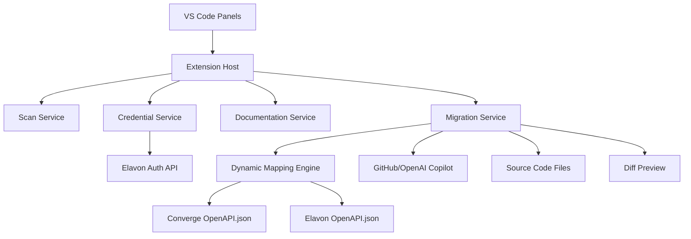

# 📑 VS Code Plugin – Converge → Elavon Migrator (Updated with OpenAPI-based Mapping)

---

## 1. Overview

The plugin automates migration of Converge APIs (XML-based) to Elavon APIs (JSON-based).
It uses **OpenAPI.json specs of both systems** to dynamically generate migration mappings (endpoint-level + field-level), rather than relying on a static `mapping.json`.

---

## 2. Panels

### **Panel 1 – Project Scan**

* Scan repo for:

  * Converge endpoints (`/hosted-payments`, `/Checkout.js`, `/ProcessTransactionOnline`, `/batch-processing`).
  * Controller/service classes.
  * `ssl_*` fields.
* Results in **tree view**:

  * Endpoints
  * Controllers/Services
  * Fields
* Inline actions:

  * Right-click → “Migrate to Elavon”
  * CodeLens → “Migrate” above Converge methods

---

### **Panel 2 – Credentials Manager**

* **Tree Structure**:

  * **Converge Credentials (Auto-populated)** → scanned from configs/properties.
  * **Elavon Credentials (User-entered)** → Client ID, Client Secret, Merchant ID.
* Stored securely via VS Code Secret Storage.
* **Play/Test button** → calls Elavon Auth API → shows response (✅ / ❌).

---

### **Panel 3 – Documentation Viewer**

* **Side-by-Side Docs**:

  * **Left:** Converge OpenAPI.json
  * **Right:** Elavon OpenAPI.json
* Interactive features:

  * Highlight equivalent fields (e.g., `ssl_amount` ↔ `amount.total`) using dynamic schema comparison.
  * Search field to look up endpoints or attributes.

---

### **Panel 4 – Migration Suggestions**

* **Dynamic Mapping Engine**:

  * Parse both OpenAPI specs.
  * Build **mapping dictionary in memory**.
  * Send Converge snippet + dynamic mapping rules → Copilot.
* **Workflow**:

  * Diff Preview → Inline acceptance/rollback.
  * Bulk Migration → Apply across repo.

---

## 3. Updated Architecture

---

## 4. Functional Requirements

### **Panel 1 – Project Scan**

* FR1.1: Must identify Converge endpoints using regex + OpenAPI.json reference.
* FR1.2: Must display endpoints/controllers/fields in tree view.
* FR1.3: Must enable right-click/CodeLens migration actions.

### **Panel 2 – Credentials**

* FR2.1: Auto-populate Converge credentials.
* FR2.2: Allow adding Elavon credentials securely.
* FR2.3: Include “Test” button → call Auth API → display success/failure.

### **Panel 3 – Documentation**

* FR3.1: Must parse **Converge OpenAPI.json** + **Elavon OpenAPI.json**.
* FR3.2: Show **side-by-side docs** with live schema comparison.
* FR3.3: Must highlight corresponding fields automatically.

### **Panel 4 – Migration**

* FR4.1: Must dynamically generate field mappings from OpenAPI schemas.
* FR4.2: Must send Converge code + dynamic mapping rules → Copilot.
* FR4.3: Must display diff preview, accept/rollback inline.
* FR4.4: Must support bulk migration.

---

## 5. Non-Functional Requirements

* **Performance:** OpenAPI parsing ≤ 2s for each spec.
* **Security:** Elavon credentials never stored in plaintext.
* **Extensibility:** Supports new endpoints if OpenAPI.json changes.
* **Reliability:** Mapping engine must gracefully handle unmapped fields (log + highlight).

---

✅ This way, the **OpenAPI.json drives everything** — scanning, documentation, mapping, and migration.
No more manual `mapping.json` maintenance.

---

<<<<<<< HEAD
Do you want me to now **expand this into a task list (Agile Epics → Stories → Tasks)**, with separate epics for **Scan, Credentials, Docs, Migration** so you can directly load them into JIRA or GitHub Projects?
=======
## 8. Benefits

* **Time Savings:** 70–80% faster migrations.
* **Accuracy:** Guided by structured mapping JSON.
* **Consistency:** Standardized modernization across teams.
* **Security:** Keys stored safely.
* **AI-Powered:** Copilot accelerates migration, enforces clean code.
* **Future-Proof:** Mapping JSON extendable to new endpoints.

---

>>>>>>> b9750a1f17ee69780b4ba1f1d28d708f2c154a74
