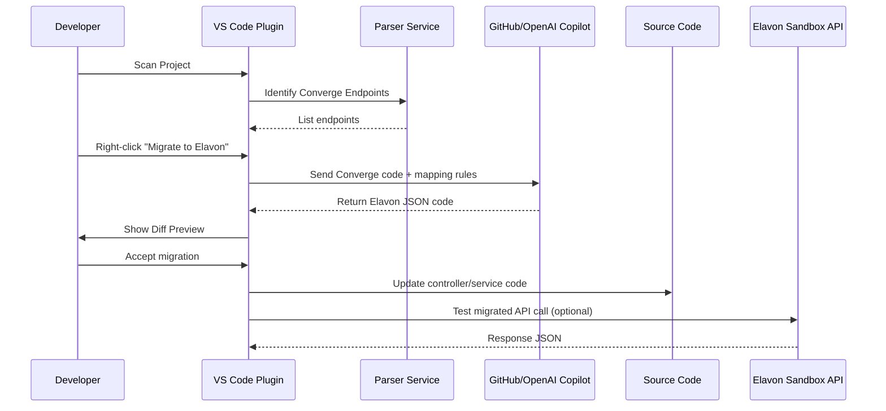

Got it ✅ Harish — I’ll bundle **everything we’ve built so far** into a single comprehensive file.
This file can serve as the **master PRD + design + mapping dictionary** for your VS Code plugin project.

---

# 📑 VS Code Plugin – Converge → Elavon Migration (Master Document)

---

## 1. Overview

This VS Code plugin automates migration of **legacy Converge APIs (REST + XML)** into **modern Elavon APIs (REST + JSON)**. It scans the codebase, identifies Converge endpoints, and uses **Copilot (GitHub/OpenAI)** to rewrite existing controller/service logic into Elavon-compliant code. The plugin also provides panels for scanning, credentials, documentation, migration previews, and inline updates.

---

## 2. Goals

* Automate Converge → Elavon modernization.
* Reduce manual XML→JSON mapping effort.
* Provide AI-assisted migration via Copilot.
* Maintain developer workflow in VS Code.
* Ensure consistency, accuracy, and security.

---

## 3. Key Features

### Panel 1 – Project Scan

* Scans repo, finds Converge endpoints (`/hosted-payments`, `/Checkout.js`, `/ProcessTransactionOnline`).
* Lists controllers/services using `ssl_*` fields.

### Panel 2 – Credentials

* Secure Elavon `pk_` and `sk_` keys via VS Code Secret Storage.

### Panel 3 – Documentation

* Side-by-side Converge (XML) vs Elavon (JSON) documentation.
* Shows OpenAPI specs for both.

### Panel 4 – Migration Suggestions

* Right-click endpoint → **Migrate to Elavon**.
* Copilot prompt includes Converge code + mapping dictionary.
* Copilot returns Elavon-compliant JSON code.
* Diff preview → accept → inline update.
* Undo/rollback supported.

### Validation

* Runs sandbox call against Elavon API (`https://uat.api.converge.eu.elavonaws.com`).

### Bulk Migration

* “Migrate All Endpoints” option.

---

## 4. Architecture

```mermaid
flowchart TD
    A[VS Code Plugin UI] -->|Commands| B[Extension Host]
    B --> C[Parser Service (XML→JSON Mapping)]
    B --> D[Copilot Service]
    D -->|Prompt+Response| E[GitHub/OpenAI Copilot]
    B --> F[Diff Preview Engine]
    B --> G[File Updater]
    B --> H[Credential Storage]
    H --> I[Elavon Sandbox API]
```

---

## 5. Migration Flow with Copilot



---

## 6. Endpoint Mapping Strategy

| **Converge Endpoint**                | **Elavon Endpoint** | **Notes**                    |
| ------------------------------------ | ------------------- | ---------------------------- |
| `/hosted-payments/transaction_token` | `/transactions`     | Token → Transaction          |
| `/Checkout.js`                       | `/payment-sessions` | Checkout → Payment Sessions  |
| `/ProcessTransactionOnline`          | `/orders`           | General XML txn → JSON Order |
| `/batch-processing`                  | `/batches`          | Batch XML/CSV → Batch JSON   |
| `/NonElavonCertifiedDevice`          | `/terminals`        | Devices → Terminals          |

---

## 7. Comprehensive Mapping Dictionary

```json
{
  "mappings": [
    {
      "convergeEndpoint": "/hosted-payments/transaction_token",
      "elavonEndpoint": "/transactions",
      "method": "POST",
      "fieldMappings": {
        "ssl_account_id": "processorAccount.id",
        "ssl_user_id": "merchantAlias",
        "ssl_pin": "apiKey.secret (sk_*)",
        "ssl_transaction_type": "type",
        "ssl_amount": "amount.total",
        "ssl_tax_amount": "amount.tax",
        "ssl_shipping_amount": "amount.shipping",
        "ssl_currency_code": "amount.currency",
        "ssl_invoice_number": "invoiceNumber",
        "ssl_merchant_txn_id": "customReference",
        "ssl_description": "description",
        "ssl_customer_code": "customer.code",
        "ssl_first_name": "customer.firstName",
        "ssl_last_name": "customer.lastName",
        "ssl_company": "customer.company",
        "ssl_email": "customer.email",
        "ssl_phone": "customer.phone",
        "ssl_avs_address": "customer.address.line1",
        "ssl_address2": "customer.address.line2",
        "ssl_city": "customer.address.city",
        "ssl_state": "customer.address.state",
        "ssl_avs_zip": "customer.address.postalCode",
        "ssl_country": "customer.address.country",
        "ssl_card_number": "card.pan",
        "ssl_exp_date": "card.expiry",
        "ssl_cvv2cvc2": "card.securityCode",
        "ssl_token": "paymentInstrument.token",
        "ssl_add_token": "paymentInstrument.addToken",
        "ssl_get_token": "paymentInstrument.getToken",
        "ssl_void_transaction_id": "relatedTransactionId",
        "ssl_recurring_flag": "recurring.enabled",
        "ssl_recurring_id": "recurring.id"
      }
    },
    {
      "convergeEndpoint": "/Checkout.js",
      "elavonEndpoint": "/payment-sessions",
      "method": "POST",
      "fieldMappings": {
        "ssl_txn_auth_token": "sessionId",
        "ssl_amount": "amount.total",
        "ssl_currency_code": "amount.currency",
        "ssl_first_name": "shopper.firstName",
        "ssl_last_name": "shopper.lastName",
        "ssl_email": "shopper.email",
        "ssl_phone": "shopper.phone",
        "ssl_avs_address": "shopper.address.line1",
        "ssl_address2": "shopper.address.line2",
        "ssl_city": "shopper.address.city",
        "ssl_state": "shopper.address.state",
        "ssl_avs_zip": "shopper.address.postalCode",
        "ssl_country": "shopper.address.country",
        "ssl_card_number": "card.pan",
        "ssl_exp_date": "card.expiry",
        "ssl_cvv2cvc2": "card.securityCode"
      }
    },
    {
      "convergeEndpoint": "/ProcessTransactionOnline",
      "elavonEndpoint": "/orders",
      "method": "POST",
      "fieldMappings": {
        "ssl_transaction_type": "type",
        "ssl_amount": "amount.total",
        "ssl_currency_code": "amount.currency",
        "ssl_invoice_number": "invoiceNumber",
        "ssl_merchant_txn_id": "customReference",
        "ssl_description": "description",
        "ssl_token": "paymentInstrument.token",
        "ssl_add_token": "paymentInstrument.addToken",
        "ssl_get_token": "paymentInstrument.getToken",
        "ssl_void_transaction_id": "relatedTransactionId"
      }
    },
    {
      "convergeEndpoint": "/batch-processing",
      "elavonEndpoint": "/batches",
      "method": "POST",
      "fieldMappings": {
        "batch_file": "transactions[]",
        "ssl_account_id": "processorAccount.id",
        "ssl_user_id": "merchantAlias",
        "ssl_batch_number": "batch.number",
        "ssl_batch_date": "batch.date",
        "ssl_total_amount": "batch.totalAmount",
        "ssl_total_count": "batch.transactionCount"
      }
    },
    {
      "convergeEndpoint": "/NonElavonCertifiedDevice",
      "elavonEndpoint": "/terminals",
      "method": "GET/POST",
      "fieldMappings": {
        "ssl_terminal_id": "id",
        "ssl_device_name": "name",
        "ssl_bin_number": "processorAccount.bin",
        "ssl_status": "status",
        "ssl_location": "location",
        "ssl_last_update": "lastUpdated"
      }
    }
  ]
}
```

---

## 8. Benefits

* **Time Savings:** 70–80% faster migrations.
* **Accuracy:** Guided by structured mapping JSON.
* **Consistency:** Standardized modernization across teams.
* **Security:** Keys stored safely.
* **AI-Powered:** Copilot accelerates migration, enforces clean code.
* **Future-Proof:** Mapping JSON extendable to new endpoints.

---

## 9. Cursor AI Prompt (Development Scaffold)

```
You are an expert VS Code extension developer.  
Build a VS Code plugin named "Converge-to-Elavon Migrator" with these features:

- Use TypeScript + VS Code Extension API.
- Panels: Scan, Credentials, Documentation, Migration Suggestions.
- Detect Converge XML endpoints (transaction_token, Checkout.js, ProcessTransactionOnline, Batch Processing, Devices).
- Map them to Elavon JSON endpoints using mapping.json.
- Right-click "Migrate to Elavon" → send existing code + mapping rules to GitHub/OpenAI Copilot.
- Copilot returns Elavon-compliant JSON code.
- Show diff preview → update controller/service inline.
- Securely store pk_/sk_ keys using VS Code Secret Storage.
- Validate migrated code against Elavon sandbox (https://uat.api.converge.eu.elavonaws.com).
- Scaffold structure:
  /src/extension.ts
  /src/panels/{ScanPanel, CredentialPanel, DocPanel, MigrationPanel}.ts
  /src/services/{CopilotService, ParserService}.ts
  /resources/mapping.json
  package.json
  README.md
```
