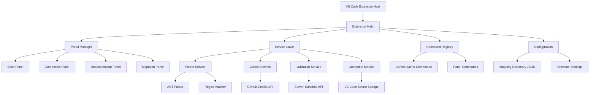

# Design Document

## Overview

The Converge-to-Elavon Migrator is a VS Code extension built using TypeScript and the VS Code Extension API. The plugin provides a comprehensive migration toolkit through multiple panels and services, leveraging GitHub Copilot for AI-assisted code transformation and VS Code's Secret Storage for secure credential management.

## Architecture



## Multi-Language Support Architecture

### Supported Programming Languages

The extension provides comprehensive support for detecting Converge API integrations across multiple programming languages:

1. **JavaScript (.js, .jsx)** - fetch(), axios, XMLHttpRequest, jQuery AJAX
2. **TypeScript (.ts, .tsx)** - Enhanced type-aware detection with interface support
3. **PHP (.php)** - curl_setopt(), file_get_contents(), WordPress wp_remote_* functions
4. **Python (.py)** - requests library, urllib, http.client modules
5. **Java (.java)** - HttpClient, HttpPost, HttpGet, URL classes
6. **C# (.cs)** - HttpClient, WebRequest, RestSharp, WebClient classes
7. **Ruby (.rb)** - Net::HTTP, HTTParty, RestClient, Faraday libraries

### Language-Specific Pattern Detection

Each language has specialized pattern detection for:

- **HTTP Client Libraries**: Language-specific HTTP request patterns
- **SSL Field Syntax**: Variable declarations, object properties, hash keys, symbols
- **Configuration Patterns**: Environment variables, config files, credential storage
- **Comment Analysis**: TODO comments and migration notes

### Pattern Confidence Scoring

The system provides confidence scores (0-100%) based on:
- Pattern match strength and specificity
- Supporting evidence (SSL fields, URLs, context)
- Language-specific syntax validation
- Code context analysis

## Components and Interfaces

### Core Extension (`src/extension.ts`)

The main extension entry point that:
- Registers all commands and panels
- Initializes services
- Manages extension lifecycle
- Handles activation/deactivation

```typescript
interface ExtensionContext {
  activate(context: vscode.ExtensionContext): void;
  deactivate(): void;
}
```

### Panel System (`src/panels/`)

#### Scan Panel (`ScanPanel.ts`)
- Displays project scanning interface
- Shows discovered Converge endpoints
- Provides file navigation to endpoint locations
- Triggers bulk migration workflows

```typescript
interface ScanPanelProvider extends vscode.WebviewViewProvider {
  scanProject(): Promise<ConvergeEndpoint[]>;
  displayResults(endpoints: ConvergeEndpoint[]): void;
  navigateToEndpoint(endpoint: ConvergeEndpoint): void;
}
```

#### Credentials Panel (`CredentialPanel.ts`)
- Secure input forms for Elavon API keys
- Credential validation and testing
- Integration with VS Code Secret Storage

```typescript
interface CredentialPanelProvider extends vscode.WebviewViewProvider {
  storeCredentials(publicKey: string, secretKey: string): Promise<void>;
  validateCredentials(): Promise<boolean>;
  testConnection(): Promise<ValidationResult>;
}
```

#### Documentation Panel (`DocPanel.ts`)
- Side-by-side API documentation viewer
- Interactive mapping dictionary display
- Endpoint-specific documentation lookup

```typescript
interface DocPanelProvider extends vscode.WebviewViewProvider {
  displayMapping(convergeEndpoint: string): void;
  showFieldMappings(endpoint: EndpointMapping): void;
  updateDocumentation(): void;
}
```

#### Migration Panel (`MigrationPanel.ts`)
- Migration progress tracking
- Diff preview and approval interface
- Rollback and undo functionality

```typescript
interface MigrationPanelProvider extends vscode.WebviewViewProvider {
  showMigrationPreview(diff: CodeDiff): void;
  applyMigration(migration: Migration): Promise<void>;
  rollbackMigration(migrationId: string): Promise<void>;
}
```

### Service Layer (`src/services/`)

#### Parser Service (`ParserService.ts`)
- Multi-language code analysis and endpoint detection
- Language-specific pattern matching for accurate identification
- Enhanced regex-based pattern matching for Converge APIs across all supported languages

```typescript
interface ParserService {
  scanWorkspace(): Promise<ConvergeEndpoint[]>;
  parseFile(filePath: string): Promise<ConvergeEndpoint[]>;
  extractConvergeCode(endpoint: ConvergeEndpoint): string;
  getPatternStatistics(): LanguagePatternStats;
  getSupportedLanguages(): string[];
}

interface LanguagePatternStats {
  supportedLanguages: string[];
  patternStats: PatternStatistics;
  totalPatterns: number;
}
```

#### Pattern Matching Service (`PatternMatchingService.ts`)
- Advanced regex pattern library for multi-language support
- Language-specific SSL field detection and HTTP client identification
- Confidence scoring for pattern matches

```typescript
interface PatternMatchingService {
  detectEndpoints(code: string, filePath: string): EndpointDetection[];
  extractSSLFields(code: string, language?: string): SSLFieldDetection[];
  detectHTTPClientUsage(code: string, language: string): HTTPClientDetection[];
  detectConfigurationPatterns(code: string): ConfigurationDetection[];
  analyzeCode(code: string): ComprehensiveAnalysis;
}

interface EndpointDetection {
  type: ConvergeEndpointType;
  matches: RegExpMatchArray[];
  confidence: number;
}

interface SSLFieldDetection {
  field: string;
  line: number;
  context: string;
  confidence: number;
}
```
```

#### Copilot Service (`CopilotService.ts`)
- GitHub Copilot API integration
- Prompt engineering for migration tasks
- Response processing and validation

```typescript
interface CopilotService {
  generateMigration(convergeCode: string, mapping: EndpointMapping): Promise<string>;
  createPrompt(code: string, mapping: EndpointMapping): string;
  validateResponse(response: string): boolean;
}
```

#### Validation Service (`ValidationService.ts`)
- Elavon sandbox API testing
- Response validation and error handling
- Credential verification

```typescript
interface ValidationService {
  testEndpoint(elavonCode: string, credentials: Credentials): Promise<ValidationResult>;
  validateCredentials(credentials: Credentials): Promise<boolean>;
  parseSandboxResponse(response: any): ValidationResult;
}
```

#### Credential Service (`CredentialService.ts`)
- Secure credential storage and retrieval
- Key format validation
- Encryption and security handling

```typescript
interface CredentialService {
  store(publicKey: string, secretKey: string): Promise<void>;
  retrieve(): Promise<Credentials | null>;
  validate(credentials: Credentials): boolean;
  clear(): Promise<void>;
}
```

## Data Models

### Core Types

```typescript
interface ConvergeEndpoint {
  id: string;
  filePath: string;
  lineNumber: number;
  endpointType: ConvergeEndpointType;
  code: string;
  sslFields: string[];
  language: string;
  confidence?: number;
  httpMethods?: string[];
  hasConfiguration?: boolean;
}

enum ConvergeEndpointType {
  HOSTED_PAYMENTS = 'hosted-payments',
  CHECKOUT = 'Checkout.js',
  PROCESS_TRANSACTION = 'ProcessTransactionOnline',
  BATCH_PROCESSING = 'batch-processing',
  DEVICE_MANAGEMENT = 'NonElavonCertifiedDevice'
}

interface EndpointMapping {
  convergeEndpoint: string;
  elavonEndpoint: string;
  method: string;
  fieldMappings: Record<string, string>;
}

interface Migration {
  id: string;
  endpoint: ConvergeEndpoint;
  originalCode: string;
  migratedCode: string;
  mapping: EndpointMapping;
  status: MigrationStatus;
  timestamp: Date;
}

enum MigrationStatus {
  PENDING = 'pending',
  IN_PROGRESS = 'in_progress',
  COMPLETED = 'completed',
  FAILED = 'failed',
  ROLLED_BACK = 'rolled_back'
}

interface Credentials {
  publicKey: string;
  secretKey: string;
}

interface ValidationResult {
  success: boolean;
  response?: any;
  error?: string;
  statusCode?: number;
}

interface CodeDiff {
  original: string;
  modified: string;
  filePath: string;
  lineNumber: number;
}
```

### Mapping Dictionary Structure

```typescript
interface MappingDictionary {
  mappings: EndpointMapping[];
  version: string;
  lastUpdated: Date;
}
```

## Error Handling

### Error Categories

1. **Parsing Errors**: Invalid code structure, unrecognized patterns
2. **Copilot Errors**: API failures, invalid responses, rate limiting
3. **Validation Errors**: Sandbox API failures, credential issues
4. **File System Errors**: Permission issues, file not found, write failures

### Error Handling Strategy

```typescript
interface ErrorHandler {
  handleParsingError(error: ParsingError): void;
  handleCopilotError(error: CopilotError): void;
  handleValidationError(error: ValidationError): void;
  handleFileSystemError(error: FileSystemError): void;
}

class ErrorNotificationService {
  showError(message: string, actions?: string[]): void;
  showWarning(message: string): void;
  showInfo(message: string): void;
}
```

### Retry Logic

- Copilot API calls: 3 retries with exponential backoff
- Sandbox validation: 2 retries with 1-second delay
- File operations: 1 retry after 500ms delay

## Testing Strategy

### Unit Testing

- **Parser Service**: Test endpoint detection accuracy with sample code files
- **Copilot Service**: Mock API responses and test prompt generation
- **Validation Service**: Mock sandbox API and test response handling
- **Credential Service**: Test secure storage and retrieval operations

### Integration Testing

- **End-to-End Migration**: Test complete migration workflow from scan to validation
- **Panel Integration**: Test panel communication and state management
- **VS Code Integration**: Test command registration and context menu functionality

### Test Data

- Sample Converge code files with various endpoint patterns
- Mock Copilot responses for different migration scenarios
- Elavon sandbox response samples for validation testing

### Testing Framework

- **Jest** for unit and integration tests
- **VS Code Test Runner** for extension-specific testing
- **Mock Service Worker** for API mocking

## Visual Design and Branding

### Extension Icon and Logo

- Use provided image as the main plugin icon in VS Code marketplace
- Implement consistent branding across all panels and UI elements
- Ensure icon meets VS Code extension guidelines (128x128px minimum)
- Create variations for different contexts (panel icons, command palette, etc.)

### UI Theme Integration

- Follow VS Code's theme system for consistent appearance
- Support both light and dark themes
- Use VS Code's color tokens for proper theme integration
- Implement accessible color contrasts for all UI elements

## Security Considerations

### Credential Security

- Use VS Code Secret Storage API for all sensitive data
- Never log or display secret keys in plain text
- Implement key format validation to prevent invalid credentials
- Clear credentials on extension deactivation if requested

### Code Security

- Validate all Copilot-generated code before application
- Sanitize file paths to prevent directory traversal
- Implement permission checks before file modifications
- Use secure HTTPS connections for all API calls

### Data Privacy

- No user code is stored permanently by the extension
- Copilot interactions follow GitHub's privacy policies
- Local mapping dictionary contains no sensitive information
- All API calls use encrypted connections

## Performance Optimization

### Scanning Performance

- Implement incremental scanning for large codebases
- Use worker threads for CPU-intensive parsing operations
- Cache scan results with file modification time tracking
- Provide progress indicators for long-running operations

### Memory Management

- Stream large files instead of loading entirely into memory
- Dispose of webview resources when panels are closed
- Implement garbage collection for completed migrations
- Limit concurrent Copilot API calls to prevent memory spikes

### User Experience

- Debounce user input in credential forms
- Implement lazy loading for documentation content
- Provide cancellation options for long-running operations
- Cache frequently accessed mapping data